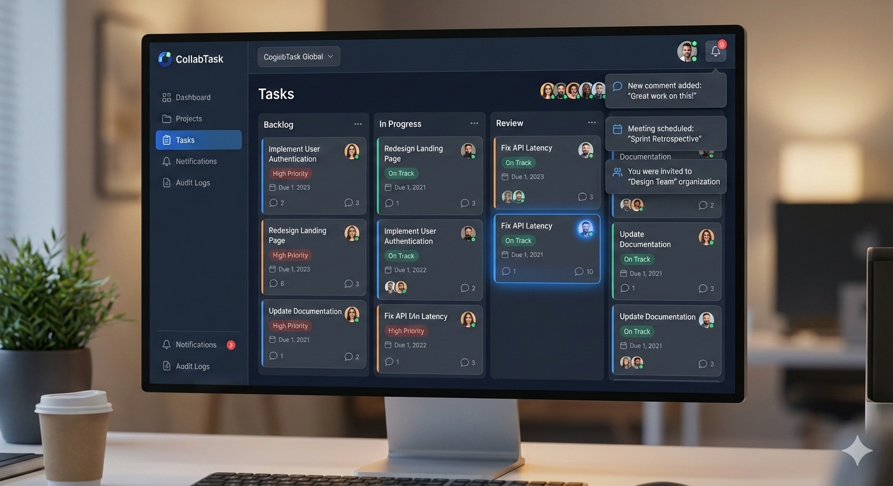

# CollabTask

**Real-time collaborative task management with enterprise-grade architecture.**

CollabTask is a full-stack application built to showcase **system design**, **scalable codebase patterns**, **type safety**, and **reusable component architecture**. It demonstrates WebSocket-powered live updates, multi-tenant organizations, RBAC, optimistic locking, activity audit trails, and modern React/Next.js + FastAPI practices.

---

## 🚀 Live Demo

**[→ https://collab-task-woad.vercel.app/](https://collab-task-woad.vercel.app/)**



### Interview & portfolio highlights

- **System design:** WebSockets for real-time notifications, multi-tenant org model, Redis rate limiting, Celery background jobs, activity audit logs, optimistic locking on tasks.
- **Type safety:** End-to-end TypeScript + Zod (frontend) and Pydantic (backend); typed API client and shared domain types.
- **Reusable UI:** shadcn/ui, CVA variants, shared form + layout components, `cn()` utility.
- **Scalable structure:** Clear split between API routes, managers, models, and frontend services/stores; Docker Compose for local stack.

---

## ✨ Features

| Feature | Description |
|--------|-------------|
| **Real-time Collaboration** | WebSocket-powered live notifications; team members see org invites, comments, and task updates instantly. |
| **Task & Project Management** | Kanban boards, task lists, project timelines, drag-and-drop status updates, and assignees. |
| **Smart Notifications** | In-app notifications over WebSockets; optional email (SendGrid) for OTP, invites, and alerts. |
| **Activity & Audit Logs** | Immutable activity logs for tasks, projects, and orgs (create, update, assign, archive) for compliance and accountability. |
| **Multi-tenant Architecture** | Organization-scoped workspaces; isolated projects, members, and roles per org. |
| **Enterprise Security** | JWT auth, refresh tokens, RBAC (member/admin/owner), rate limiting (Redis), and request ID tracing. |

---

## 🛠 Tech Stack

### Frontend
- **Framework:** [Next.js 16](https://nextjs.org/) (App Router), [React 19](https://react.dev/)
- **Language:** [TypeScript](https://www.typescriptlang.org/) (strict mode)
- **State:** [Redux Toolkit](https://redux-toolkit.js.org/) (slices for auth, orgs, projects, tasks, dashboard)
- **Forms & Validation:** [React Hook Form](https://react-hook-form.com/) + [Zod](https://zod.dev/) + [@hookform/resolvers](https://github.com/react-hook-form/resolvers)
- **UI:** [Tailwind CSS](https://tailwindcss.com/), [Radix UI](https://www.radix-ui.com/), [shadcn/ui](https://ui.shadcn.com/) (New York), [Lucide](https://lucide.dev/) icons
- **Styling Utilities:** [class-variance-authority (CVA)](https://cva.style/), [clsx](https://github.com/lukeed/clsx), [tailwind-merge](https://github.com/dai-shi/tailwind-merge)

### Backend
- **API:** [FastAPI](https://fastapi.tiangolo.com/)
- **ORM:** [Tortoise ORM](https://tortoise.github.io/) + [PostgreSQL](https://www.postgresql.org/)
- **Migrations:** [Aerich](https://github.com/tortoise/aerich)
- **Validation:** [Pydantic](https://docs.pydantic.dev/)
- **Auth:** JWT access + refresh, bcrypt, custom auth middleware & dependency injection
- **Real-time:** WebSocket endpoint (`/ws/notifications`) with per-user connection management
- **Background Jobs:** [Celery](https://docs.celeryq.dev/) + Redis (e.g. OTP & transactional emails)
- **Caching & Rate Limiting:** [Redis](https://redis.io/) (optional cache, Redis-based rate limiter)
- **Email:** [SendGrid](https://sendgrid.com/) (Jinja2 templates)

### DevOps & Deployment
- **Containers:** [Docker](https://www.docker.com/), [Docker Compose](https://docs.docker.com/compose/) (Postgres, Redis, Backend, Celery)
- **Frontend Hosting:** [Vercel](https://vercel.com/) (demo)
- **Backend:** Configurable for Cloud Run, GCP, or any container platform

---

## 🏗 System Design & Architecture

### High-Level Architecture

```
┌─────────────────┐     HTTP/WS      ┌──────────────────────────────────────────┐
│   Next.js       │ ◄──────────────► │  FastAPI Backend                         │
│   (Vercel)      │                  │  ├─ REST API (auth, orgs, projects,      │
│   React 19      │                  │  │   tasks, comments, notifications,      │
│   Redux, WS     │                  │  │   search, activity, meetings)          │
└─────────────────┘                  │  ├─ WebSocket /ws/notifications          │
                                     │  ├─ Auth middleware, rate limiting       │
                                     │  └─ Celery workers (email tasks)         │
                                     └──────────────┬───────────────────────────┘
                                                    │
                    ┌───────────────────────────────┼───────────────────────────────┐
                    ▼                               ▼                               ▼
             ┌─────────────┐                 ┌─────────────┐                 ┌─────────────┐
             │  PostgreSQL │                 │    Redis    │                 │  SendGrid   │
             │  (Tortoise) │                 │ Cache, RL,  │                 │  (Email)    │
             └─────────────┘                 │  Celery     │                 └─────────────┘
                                            └─────────────┘
```

### Design Decisions

| Concern | Approach |
|--------|----------|
| **Concurrency control** | Optimistic locking via `version` on tasks; conflict responses (e.g. 409) on stale updates. |
| **Real-time updates** | WebSocket manager tracks connections per user; notifications pushed on org invites, comments, task changes. |
| **Multi-tenancy** | All scoped resources (projects, tasks, members, activity) keyed by `organization_id`; middleware enforces org context. |
| **Audit & compliance** | Immutable `activities` table; `entity_type`, `entity_id`, `action`, `metadata`, `user_id`, `org_id`. |
| **Security** | JWT access + refresh, token storage and refresh flow, RBAC via membership roles, Redis rate limiting (per IP + per user). |
| **Scalability** | Stateless API; Redis for rate limits and Celery broker; DB connection pooling; horizontal scaling of API and workers. |

---

## 📁 Project Structure

### Frontend (`/frontend`)

```
src/
├── app/
│   ├── (auth)/          # Login, signup, forgot-password, onboarding
│   ├── (protected)/     # Dashboard, orgs, projects, tasks, calendar, inbox, search, settings
│   ├── layout.tsx, page.tsx, globals.css
├── components/
│   ├── ui/              # Reusable primitives (Button, Card, Form, Dialog, etc.)
│   ├── landing/         # Hero, Features, CollaborationInAction, WhyCollabTask, etc.
│   ├── app-sidebar.tsx, topbar.tsx, meeting-modal.tsx, theme-toggle.tsx
├── hooks/               # use-notifications (WebSocket), use-mobile, use-toast
├── lib/                 # utils (cn), storage (tokens)
├── services/            # API layer: apiClient, auth, organization, project, task, etc.
├── stores/              # Redux store, slices (auth, org, project, task, dashboard, common)
├── types/               # Shared TS types (auth, task, org, project, comment, etc.)
└── constants/           # sidebar config, etc.
```

### Backend (`/Backend`)

```
app/
├── core/           # config, db, redis, websocket_manager, celery_app, security, lifespan
├── models/         # User, Organization, Project, Task, Membership, Activity, Notification, etc.
├── schemas/        # Pydantic request/response models
├── managers/       # Business logic (auth, org, project, task, activity, notification, …)
├── routes/         # REST + WebSocket route modules
├── dependencies/   # Auth, reusable FastAPI dependencies
├── middlewares/    # Auth, rate limiting (Redis), request ID
├── exceptions/     # Custom HTTP exceptions, handler
├── services/       # Email (SendGrid)
├── tasks/          # Celery tasks (e.g. send_otp_email)
├── utils/          # Validators, API response helpers, redis_cache
└── observability/  # Logging, structure
migrations/         # Aerich (Tortoise) migrations
```

---

## 🔒 Type Safety & Validation

- **Frontend:** Full TypeScript; shared `types/` for API contracts. Forms validated with **Zod** schemas (`signupSchema`, `otpSchema`, etc.) and **React Hook Form**.
- **Backend:** **Pydantic** schemas for all request/response bodies; typed managers and route handlers.
- **API client:** Generic `apiClient.get<T>`, `post<T>`, etc., with centralized error handling and token refresh.

---

## 🧩 Reusable Components & UI

- **shadcn/ui** (New York): `Button`, `Card`, `Form`, `Input`, `Dialog`, `Sheet`, `Select`, `Table`, `Badge`, etc.
- **CVA** for variant-based components (e.g. `Button` variants: `default`, `destructive`, `outline`, `ghost`, `link`; sizes: `sm`, `lg`, `icon`).
- **`cn()`** utility (`clsx` + `tailwind-merge`) for conditional class names.
- **Consistent form patterns:** `Form`, `FormField`, `FormItem`, `FormControl`, `FormMessage` with react-hook-form + Zod.

---

## 🚀 Getting Started

### Prerequisites

- Node.js 18+, npm/pnpm
- Python 3.11+
- PostgreSQL 15+
- Redis 7+ (optional for local dev; required for rate limiting & Celery)
- (Optional) SendGrid API key for emails

### Backend

```bash
cd Backend
cp .env.example .env
# Edit .env: set POSTGRES_*, JWT_SECRET_KEY, REDIS_*, CELERY_*, SENDGRID (if used)

# Using Docker Compose (recommended)
docker compose up -d postgres redis
# Then run migrations and start API + Celery locally, or run backend in Docker too.

# Or run locally (ensure Postgres + Redis are up)
pip install -r requirements.txt
aerich upgrade  # run migrations
uvicorn app.main:app --reload --host 0.0.0.0 --port 8000
```

In another terminal, run Celery (if using email tasks):

```bash
cd Backend
celery -A app.core.celery_app worker --loglevel=info --pool=solo
```

### Frontend

```bash
cd frontend
npm install
cp .env.example .env.local   # if you have one
# Set NEXT_PUBLIC_API_BASE_URL=http://localhost:8000 (or your API URL)
npm run dev
```

Open [http://localhost:3000](http://localhost:3000). The demo runs against [https://collab-task-woad.vercel.app](https://collab-task-woad.vercel.app/)’s backend when using the deployed frontend.

### Docker Compose (Full Stack)

From `Backend`:

```bash
docker compose up -d
```

This brings up Postgres, Redis, FastAPI, and Celery. Point the frontend’s `NEXT_PUBLIC_API_BASE_URL` at `http://localhost:8000`.

---

## 📜 Environment Variables

### Backend (`.env`)

| Variable | Description |
|----------|-------------|
| `POSTGRES_HOST`, `POSTGRES_PORT`, `POSTGRES_DB`, `POSTGRES_USER`, `POSTGRES_PASSWORD` | PostgreSQL connection |
| `JWT_SECRET_KEY` | Secret for access/refresh tokens |
| `REDIS_HOST`, `REDIS_PORT`, `REDIS_DB` | Redis for rate limiting, Celery |
| `CELERY_BROKER_URL`, `CELERY_RESULT_BACKEND` | Celery broker and result backend |
| `SENDGRID_API_KEY`, `FROM_EMAIL`, `FROM_NAME` | SendGrid (optional) |
| `CORS_ORIGINS` | Comma-separated allowed origins |
| `ENVIRONMENT` | `development` / `production` |

### Frontend (`.env.local`)

| Variable | Description |
|----------|-------------|
| `NEXT_PUBLIC_API_BASE_URL` | Backend API base URL (e.g. `http://localhost:8000`) |

---

## 📄 License

See [LICENSE](LICENSE).

---

## 🔗 Links

- **Demo:** [https://collab-task-woad.vercel.app/](https://collab-task-woad.vercel.app/)
- **Landing:** Real-time collaboration, task management, notifications, activity logs, multi-tenancy, and security overview.

If you use this project in portfolios or interviews, consider emphasizing: **system design** (WebSockets, multi-tenancy, rate limiting, audit logs), **type safety** (TypeScript + Zod + Pydantic), **reusable UI** (shadcn, CVA, `cn`), and **scalable structure** (clean separation of API, managers, models, and frontend services/stores).
